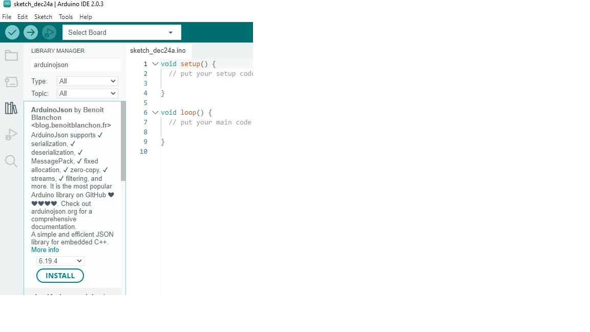
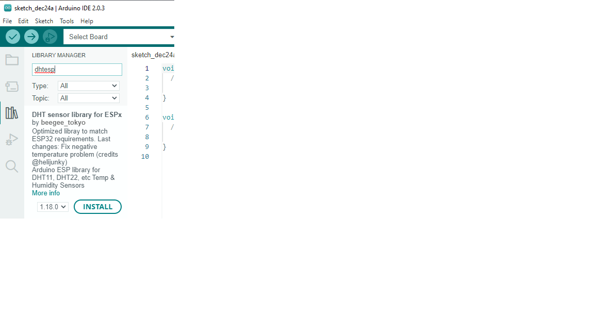

# GarageThermostat

Project to control the temperature in my garage.
Custom HW and a server that runs in a Docker container on my Synology NAS.

I am using a esp8266 in the garage to control the furnace and report back to
the server.

Variables:
 - temp, temp in deg C * 100
 - hum, humidity in % *100
 - heat, 0/1 if set to ON
 - heating, 0/1 if furnace is heating
 - setpt, temp in deg C * 100
 - id, the mac address of the device

 When compiling with the Arduino IDE you need to install the following packages:

 
 
 
 
