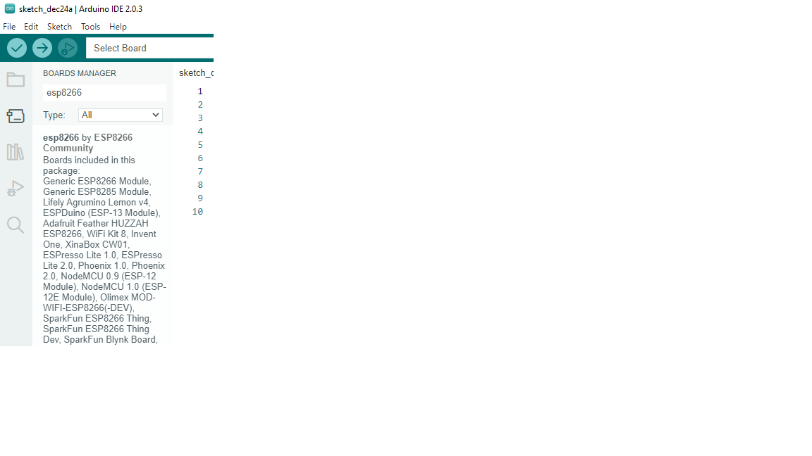
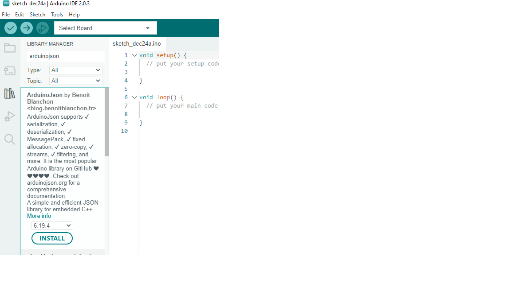
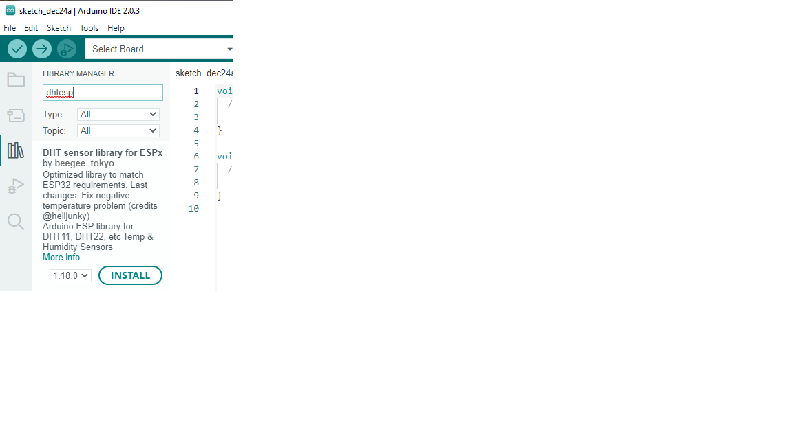

# GarageThermostat

Project to control the temperature in my garage.
Custom HW and a server that runs in a Docker container on my Synology NAS.

I am using a esp8266 in the garage to control the furnace and report back to
the server.

Variables:
 - temp, temp in deg C * 100
 - hum, humidity in % *100
 - heat, 0/1 if set to ON
 - heating, 0/1 if furnace is heating
 - setpt, temp in deg C * 100
 - id, the mac address of the device

## Local development

Install dependencies once from the repository root:

```sh
npm install
```

Build both applications and start the server:

```sh
npm start
```

To create build artifacts without starting the server, run:

```sh
npm run build
```

## Docker deployment

From the repository root, build an image that compiles the React client and
TypeScript server inside Docker:

```sh
docker build -t garage-thermostat:latest .
```

Run it on the NAS, publishing the browser UI/API on port 3000 and the ESP
controller endpoint on port 8085:

```sh
docker run -d --name garage-thermostat --restart unless-stopped \
	-p 3000:3000 -p 8085:8085 \
	-v /volume1/docker/garage-thermostat:/data \
	garage-thermostat:latest
```

Open `http://<nas-address>:3000` in a browser. Configure the ESP controller to
send updates to `http://<nas-address>:8085/data`. Change the host path before
running the command if your NAS stores Docker data elsewhere.

 When compiling with the Arduino IDE you need to install the following packages:

 
 
 
 
